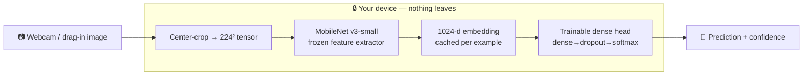

<div align="center">

# Teach Bitsy 🤖

### Teach a robot. Break it. Fix it. Learn how AI really works.

A train-your-own-model web app for kids (ages 5–9). A child teaches **Bitsy** the robot to
tell two things apart — cats vs dogs, spoons vs forks, you name it — using webcam photos or
drag-in images, watches her learn in real time, tests her, then deliberately *tricks* her to
discover why good data matters. **Every bit of ML runs in the browser. Nothing ever leaves the
device.**

<!-- Banner: drop a hero image at docs/banner.png -->


[](https://github.com/Santoshrt999/teach-bitsy/actions/workflows/ci.yml)
[](LICENSE)
[](https://github.com/Santoshrt999/teach-bitsy/pulls)
[](#)

</div>

---

## 🔒 Privacy first (read this if you're a parent or teacher)

**100% on-device. No accounts. No uploads. No tracking.**

Teach Bitsy has **no backend and no analytics**. Webcam frames and images are processed in your
browser and stored only on your device. The camera stream is *never* recorded or sent anywhere.
The app makes **zero third-party network requests at runtime** — even the AI model and fonts are
served from the app itself — and a Content-Security-Policy enforces it.

> **A note on COPPA:** The US Children's Online Privacy Protection Act regulates *collecting
> personal information* from children under 13. Teach Bitsy collects **nothing** — no sign-up,
> no PII, no uploads — so there's essentially nothing to comply with. This zero-backend design
> isn't just a cost saving; it's what makes the app safe to put in front of kids.

---

## ✨ The flow (4 screens)

> _Animated walkthrough coming soon — drop a GIF at `docs/demo.gif`._
>
> 

| | Screen | What the kid does |
|---|---|---|
| 📦 | **Collect** | Fill two buckets with example photos (camera or drag-in). |
| 🧠 | **Teach** | Press *Teach Bitsy!* and watch the Smartness meter rise and the Oops meter fall. |
| 🔮 | **Test** | Show Bitsy something new — she guesses, with a "How sure am I?" bar. |
| 😵 | **Trick** | Give Bitsy bad data on purpose, watch her get confused, then fix it. |

## 🎓 What your kid is *actually* learning

Every playful element maps to a real machine-learning concept:

| In the app | The real concept |
|---|---|
| Buckets / labels | **Classes** & labeled training data |
| "Teach Bitsy!" | **Transfer learning** (a frozen feature extractor + a small trainable head) |
| Smartness meter | **Training accuracy** |
| Oops meter (the line going down) | **Cost / loss function** minimized by **gradient descent** |
| "How sure am I?" bar | **Softmax** probability / model confidence |
| Trick mode | **Data quality** — "garbage in, garbage out" |
| Fix-the-labels | **Label noise** and how cleaning data restores performance |

Flip on **Grown-up mode** to relabel the Oops meter as *Loss J(w,b)* and reveal the optimizer,
learning rate, epoch count, and active compute backend.

## 🚀 Quick start

```bash
pnpm install     # install dependencies
pnpm dev         # start the dev server (http://localhost:5173)
pnpm build       # production build
pnpm preview     # preview the production build
```

Other scripts: `pnpm typecheck` · `pnpm lint` · `pnpm test`.

> Requires **Node 20+** and **pnpm**. A WebGPU- or WebGL-capable browser is recommended (the app
> falls back to WASM, then CPU). Camera capture needs a `https://` origin or `localhost`.

## 🧰 Tech stack

- **Vite 6** + **React 19** + **TypeScript** (strict)
- **TensorFlow.js 4** — WebGPU → WebGL → WASM → CPU backend fallback
- **MobileNet v3-small** (self-hosted) as a frozen feature extractor + a tiny trainable head
- **Tailwind CSS v4** · **Motion** (animations) · **Zustand** (state)
- **vite-plugin-pwa** (installable, offline) · **Vitest** + **React Testing Library**

## 🏗️ Architecture

All inference and training happen client-side. A frozen MobileNet turns each image into a
feature vector; only a small dense "head" is trained on the child's examples.



## 🗺️ Roadmap

- [ ] Multi-class support (more than two buckets)
- [ ] Drawing input (teach from doodles)
- [ ] Sound classes (clap vs whistle)
- [ ] Share-a-model via URL (still no server!)
- [ ] Save/print a "report card" of what Bitsy learned

## 🤝 Contributing

PRs welcome! Please keep the privacy posture intact (no network calls, no trackers) and run
`pnpm typecheck && pnpm lint && pnpm test` before opening a PR.

## 📄 License

MIT.

<div align="center">

Built with ❤️ — and a lot of patience from **Bitsy** 🤖

</div>
